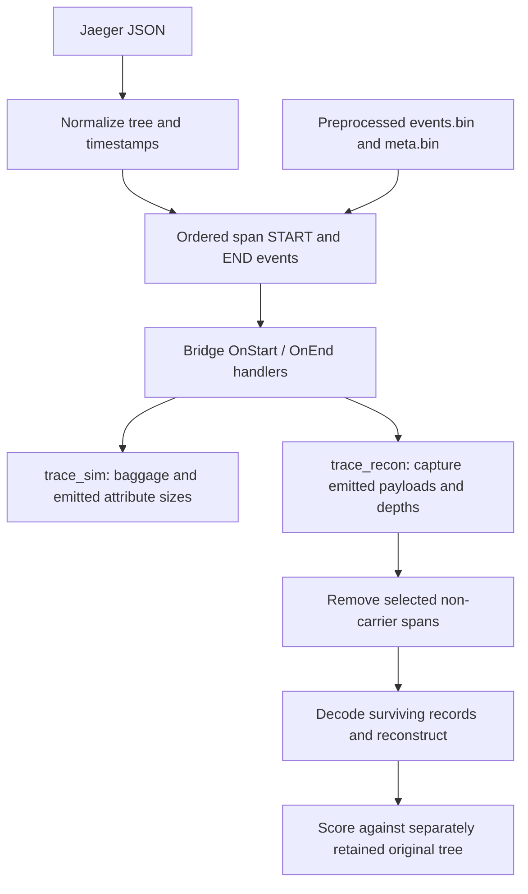

# Local installation and PB0 / CGP0 / SB3 implementation guide

Inspected and installed on 2026-09-08 from `https://github.com/docc-lab/bridges`,
commit `ef2e173b3054b4a03ace01d9f69049cf93a616d4` (main, 2026-09-03).
All analysis here concerns distributed tracing, span loss, and reconstruction.
This guide follows the current source; several older README examples and
documents describe earlier implementations.

## Installed environment

```bash
cd /users/tomislav/bridges
source env.local.sh
```

- Go **1.26.4**, matching `scripts/metal_setup.sh`, in
  `/users/tomislav/.local/lib/go`, with `go` and `gofmt` links in
  `/users/tomislav/.local/bin`. The module's minimum is Go 1.25.2.
- Module dependencies downloaded and verified against `go.sum`:
  bits-and-blooms/bloom 2.0.3, spaolacci/murmur3 1.1.0, willf/bitset 1.1.11.
- Python **3.10.12**, with an isolated `.venv`. Direct analysis dependencies:
  NumPy 2.2.6, pandas 2.3.3, SciPy 1.15.3, Matplotlib 3.10.9,
  seaborn 0.13.2. All transitive versions are pinned in
  [`requirements-local.txt`](../requirements-local.txt).
- OR-Tools C++ **9.15.6755** for Ubuntu 22.04, installed at the path already
  embedded in the repository's cgo directives:
  `/users/tomislav/or-tools_x86_64_Ubuntu-22.04_cpp_v9.15.6755`.
  Both Go and OR-Tools downloads were checked against published SHA-256 hashes.
- Host tools include Git, GCC/G++, make, zstd, curl/wget; Python venv/pip,
  CMake, pkg-config and rsync were installed as needed.

`bin/` contains freshly built commands from `cmd/`. `bin/trace_recon` is the
ordinary Go build, sufficient for PB0, CGP0 and SB3. `bin/trace_recon_cpsat`
and `bin/with-cpsat/` provide solver-enabled reconstruction and command variants.
The standalone solver bridge is `bin/cpsat`; the C++ validator is
`tools/cluster_validate/build/validate`.

`env.local.sh` activates the Python environment, adds local executables to PATH,
sets `ORT` and `LD_LIBRARY_PATH`, and selects Matplotlib's headless Agg backend.
Use the modern `bin/` commands rather than the older root-level executables.
No Jaeger server is required for the local Uber corpus workflow.

Rebuild or restore Python dependencies with:

```bash
source env.local.sh
python -m pip install -r requirements-local.txt
go mod download
go build -o bin/ ./cmd/...
go build -tags cpsat -o bin/trace_recon_cpsat ./cmd/trace_recon
go build -tags cpsat -o bin/with-cpsat/ ./cmd/...
```

The installation rebuilt the tracked `bin/trace_sim` and `bin/trace_recon`
executables. Algorithm source files and original Uber data were not modified.
Local downloads, logs, and smoke-test artifacts are in `.local/`; it and `.venv/`
are excluded through `.git/info/exclude`.

## The mode names that matter

| Requested reconstruction | `trace_sim --mode` | Emitting handler | Reconstruction entry point |
|---|---|---|---|
| `pb0` | `pcrb` | `bridge.NewPCRBBridgeHandler` | `recon.ReconstructPB0` |
| `cgp0` | `cgprb` | `bridge.NewCGPRBBridgeHandler` | `recon.ReconstructCGP0` |
| `sb3` | `sb3` | `bridge.NewSB3Handler` | `recon.ReconstructSB3WithDEE` |

PB0 and CGP0 are reconstruction names, not accepted simulator mode names.
The old simulator modes `pb` and `cgpb` emit different payloads. Similarly,
`sbridge` is the older dense-ordinal structural bridge and is distinct from SB3.
The Python `trace_simulator.py` is a reference for the older handlers; the
current PCRB/CGPRB/SB3 workflow uses the Go commands.

The wiring is in [`cmd/trace_recon/main.go`](../cmd/trace_recon/main.go)
(`makeHandler`, `cg2Reconstruct`, `decodeSpan`) and
[`cmd/trace_sim/main.go`](../cmd/trace_sim/main.go) (`makeHandler`).

## How the simulator works



1. **Load and normalize.** `loader/loader.go` reads bare Jaeger traces or
   `{"data": [...]}` wrappers, derives parents from `CHILD_OF` references,
   interns service names, and computes depths. Strict and lenient cleanup have
   different duplicate/dangling-parent policies. CRISP normalization clips
   child intervals to parent intervals and removes subtrees wholly outside
   the parent interval. Depth is recomputed afterward.
2. **Order events.** Every span contributes a START and END. The global order
   is `(timestamp, kind, depth-rank, traceID, spanID)`: START before END at a
   tie, shallow STARTs first, deep ENDs first. This is a simulation convention
   and matters for sibling ordinals and event-order scoring.
3. **Replay handler state.** `OnStart` finds parent state by `(traceID, spanID)`,
   receives the child's 1-based start ordinal, propagates ancestry baggage,
   and may emit `_br`. `OnEnd` discovers leaves and emits either their `_br`
   or an interior span's `_d`. A checkpoint is any depth divisible by CPD,
   including root depth zero. Periodic checkpoints emit on START; other
   leaves emit on END. Remaining interior spans carry absolute depth in `_d`.
4. **Account for bytes.** `trace_sim` measures modeled baggage on calls and
   emitted attributes; it does not perform reconstruction or simulate span
   drops. `_br` key overhead is 3 bytes, `_d` key overhead is 2, and these
   three modern payloads have a 1-byte type tag. These are modeled bridge
   bytes, not complete OTLP messages, JSON sizes, or network packets.
5. **Finalize.** Each trace closes after its expected START/END events are
   consumed. Per-trace handler state is evicted. SB3's DEE queues persist
   across traces. PB/CG handlers can be sharded by trace; SB3 size simulation
   stays serial to retain cross-trace queue behavior.

Source: [`bridge/bridge.go`](../bridge/bridge.go),
[`cmd/trace_sim/sim.go`](../cmd/trace_sim/sim.go),
[`cmd/trace_sim/output.go`](../cmd/trace_sim/output.go).

**Accounting detail:** `amortized_by_total` and `amortized_by_checkpoint` use
the sum of `_br` payload bytes. `_d` cost is reported separately in
`depth_overhead_sum`; include that separately when calculating total persisted
bridge overhead. `num_checkpoint_spans` includes leaf carriers as well as
periodic checkpoints. For a corpus-weighted mean, sum numerators and
denominators rather than averaging per-trace means.

## PB0: checkpoint identity plus path evidence

[`bridge/pcrb.go`](../bridge/pcrb.go) emits:

```text
_br = type 5 | uvarint(absolute depth) | checkpoint prefix | window Bloom
_d  = uvarint(absolute depth)
```

The checkpoint prefix names the preceding window root. `--prefix-len 8`
retains its complete 64-bit span ID; shorter prefixes can collide. The Bloom
contains only ancestors strictly between checkpoints. Each payload stores the
inherited, pre-self-add Bloom. Non-checkpoints add their ID for descendants;
checkpoints close the preceding window, clear the Bloom, and do not add
themselves to the new window. Capacity is `max(1, CPD-1)`.

The Bloom hashes the 16-character lowercase hexadecimal span ID. Its geometry
is derived from CPD and the configured false-positive target on both sides.
The default target is `0.0001`. Bloom positives are candidate ancestry evidence;
they do not guarantee the actual path, and the target does not directly equal
the trace reconstruction error rate.

PB0 uses the shared greedy engine with `NoFanout=true` and ordinals disabled.
It still exploits exact `ParentID` values: it materializes missing named
parents, groups fragments that name the same parent, pools their applicable
Bloom evidence, checks nameable ancestor chains, and enumerates admissible
surviving anchors inside the checkpoint window. It selects routes in
deterministic deepest-anchor order with fallback when a route contradicts
hard evidence. Unknown intermediate levels receive synthetic nodes.

This default is stronger than the historical first-match PB0. It can share
literal dropped parents, even though it has no HA extension. The older
`docs/pb_reconstruction.md` describes legacy PB and is not the canonical PB0
specification. `--pb0-legacy` explicitly restores the historical baseline.

## CGP0: retain call-graph branch identities

[`bridge/cgprb.go`](../bridge/cgprb.go) adds a window-local hash array (HA):

```text
_br = type 6 | depth | checkpoint prefix | window Bloom | HA records
HA record = exact parent span ID (8 bytes) | uvarint(child absolute depth)
```

The second-started child of a parent adds one HA record naming that branching
parent. Existing HA records propagate only through the first-child continuation;
third and later children start with no HA. Thus a fanout is named once, and its
record follows a continuation to a protected carrier. Bloom and HA both reset
at checkpoints. The recorded depth is the **child's depth**; the named parent
is at `entry.Depth-1`.

CGP0 enables HA in the same greedy engine used by PB0. A carrier containing
an HA record must pass through that exact fanout identity at that exact depth.
The engine pools upstream Bloom evidence across proven sibling/fanout groups,
prefers named fanout nodes in intermediate gaps, and tracks HA obligations
transactionally. Routes contradicting an obligation are rolled back and the
next route is tried. An unresolved parent in a partial tree leaves the
obligation pending; later attachments advance it, and an upstream route may
be revisited. Default runs should end with zero parent/HA hard conflicts.

The entry points are in [`recon/cgp_scratch.go`](../recon/cgp_scratch.go), but
the current common engine is `reconstructFullEvidenceGreedyTopology` in
[`recon/sb3_greedy.go`](../recon/sb3_greedy.go). Despite that filename, it
implements PB0 and CGP0 as well as SB3. No SAT/CP-SAT solver is used.
`--cgp0-legacy` and `--greedy-no-*` are explicit mechanism ablations.

## SB3: sparse branch order and lateral event order

[`bridge/sb3.go`](../bridge/sb3.go) uses the CGPRB topology substrate and adds
sparse ordinal/EE chains plus DEE records. Payload type is 7. HA length and
branch-record count are varint-framed; a branch record contains its ordinal
and an EE list. DEE records occupy the trailing section.

For children starting in order `1,2,...,k`, child 1 is implicit, while each
child `2..k` appends its ordinal to the inherited chain. Unary edges append
nothing. Unlike HA, the ordinal chain is inherited by every child. Chains
reset at checkpoints and appear on protected carriers. Entries have no depth
field: reconstruction aligns them to recovered paths. The number of
ordinal-bearing edges in a rooted tree is `leaves-1`; actual transmitted bytes
also depend on propagation, carriers, ordinal lengths, and EE/DEE content.

SB3 calls the shared greedy engine with ordinal pruning enabled. A transactional
window automaton enforces one implicit first child and distinct explicit
ordinals per fanout while candidate routes are being tried. Repeated inherited
ordinals are valid inside the same immediate child subtree. A conflicting
candidate is rolled back before commitment. Literal parents and HA facts take
priority if all ordinal-compatible candidates fail: the engine keeps a
hard-compatible route and reports/quarantines the conflicting ordinal evidence.
Final alignment creates the ordered tree and checks compatibility again.

The lateral evidence then recovers end-event order:

- **EE:** child starts carry the ordered sibling ends accumulated since the
  previous sibling start. These accompany the sparse record for that child.
- **DEE:** at parent end, leftover child ends that followed the last child
  start become a delayed record. The final child end is omitted and inferred
  as the unique unwitnessed ordinal. The DEE identifies its originating trace,
  owner depth and owner fingerprint, with ordering information.
- **Transport simulation:** queues are per service by default, or per supplied
  simulated instance ID. Later calls dequeue records; default is drain-all,
  with optional `--dee-dequeue-one`. Unsent backlog can remain. DEE baggage
  follows first-child continuation and is cleared at emission checkpoints.
- **Reconstruction:** after topology/ordinal alignment,
  `ApplyStructureEvidence` validates ordinal/EE lists, attributes DEEs using
  depth, fingerprints and contents, and fills each parent's `EndOrder`.
  Ambiguous attribution is reported rather than guessed. Existing structure
  utilities also support merged event sequences and synthetic timestamps.

Source: [`recon/sb3.go`](../recon/sb3.go),
[`recon/sbridge_evidence.go`](../recon/sbridge_evidence.go),
[`recon/sbridge_structure.go`](../recon/sbridge_structure.go).
`--sb3-ignore-ordinals` disables ordinal pruning but retains the other
evidence; `--topo-only` omits EE/DEE while retaining sparse ordinals.

**Current harness limitation:** `trace_recon` installs `SB3Handler.DEESink`
and collects DEEs immediately when generated. `ReconstructSB3WithDEE` receives
those records directly. It does not wait for cross-trace baggage delivery or
exclude queued records that never reach a later carrier. Topology/ordering
evaluation therefore assumes availability of generated DEE evidence. Use the
global-stream `trace_sim` for transport overhead/backlog analysis. Per-trace
store replay cannot reproduce global cross-trace DEE transport; its worker
queues are separate. End-order/critical-path accuracy is also scored only on
the subset whose topology is correct and ordinal-compatible. It is not an
unconditional end-to-end delivery success metric.

## Drop policy and score interpretation

`trace_recon` first captures payloads from the complete normalized input,
then independently removes each span without `_br` with the requested
probability. Roots, periodic checkpoints and leaves remain protected. Thus
`--drop-rate 1` removes all eligible interior spans, not all spans.

Reconstruction receives surviving IDs, literal parent IDs, depths, decoded
payload evidence and configuration. Pre-drop truth is retained separately for
scoring. `--per-trace-drop-seed --seed 42` seeds each trace deterministically
and draws over span IDs in sorted order, allowing matched drops across modes
and worker counts. `--drop-rates 0.5,1` reuses one decoded trace; rate zero
must be run separately using `--drop-rate 0`.

- PB0 uses **`path-evidence-v1`**: exactly one bridge per surviving fragment
  root, correct nearest surviving ancestor and correct missing-level count.
- CGP0/SB3 use **`evidence-bounded-v1`**: every identity exposed by surviving
  span IDs, parent IDs or HA must occupy its correct place, with the correct
  chain length through unnameable intermediate nodes. SB3 also charges
  ordinal incompatibility as `constraint_wrong`.
- `clean/feasible` is accuracy among input traces with observable reconstruction
  obligations. Here `feasible` is a denominator label, not solver feasibility.
  `clean_all/traces` additionally includes correctly empty cases.
- Hard-conflict count zero establishes consistency with exact input evidence;
  it does not establish that probabilistic ancestry choices match ground truth.

PB0 path accuracy and CGP0/SB3 topology accuracy assess different guarantees.
Do not interpret their percentages as interchangeable topology scores. See
[`reconstruction_evaluation.md`](reconstruction_evaluation.md) for the canonical
contract. Use identical selection, CPD, prefix length, Bloom geometry and
drop realizations for comparisons.

**Configuration mismatch to avoid:** `trace_recon` exposes `--prime-m` and
`--prime-m-bytecap`; the current `trace_sim` CLI exposes neither. Both use
`bloom.EstimateParameters`, but simulator runs retain non-prime geometry.
The verified examples below omit prime rounding on both sides. Matching size
measurements to a prime-rounded reconstruction would need an explicit simulator
configuration change; do not silently pair the current defaults with prime runs.

## Available Uber data

Counts below were read from the metadata, with event file sizes checked against
two 40-byte records per span plus an 8-byte header.

| Corpus | Traces | Spans | Services | `events.bin` bytes |
|---|---:|---:|---:|---:|
| `/mydata/uber/bignode_state/day1_unfilt_corpus` | 521,305 | 475,488,643 | 1,150 | 38,039,091,448 |
| `/mydata/uber/bignode_state/day2_unfilt_corpus` | 843,274 | 800,890,614 | 1,284 | 64,071,249,128 |

Also present: `day1.store`, `day2.store` (both version-2 trace stores), their
`day1_meta`/`day2_meta` directories, `corpus_full` and backup/unfiltered
variants, endpoint/instance sidecars under `endpoint_instance_state`, prior
results, archive parts, and `trace1-sanitized.tar.zst`. A directory containing
only `meta.bin` needs its corresponding `--trace-store`; it cannot directly
supply simulator events. Corpus labels and preprocessing variants matter;
these counts describe the two paths above, not every Uber variant.

`.local/smoke/day1_corpus` contains the first 250 day-1 metadata traces, and
`day2_corpus` the first 100 day-2 metadata traces. The extraction script copies
their original event records byte-for-byte, retains global event order and
service IDs, and validates expected per-trace event counts. These small
subsets are installation checks, not representative accuracy benchmarks or
full-corpus DEE traffic measurements. Their provenance is saved beside them.

## Runnable examples

```bash
cd /users/tomislav/bridges
source env.local.sh

# PB0's emission costs (switch pcrb -> cgprb or sb3 for the other schemes).
trace_sim --corpus .local/smoke/day1_corpus --mode pcrb \
  --checkpoint-distance 6 --prefix-len 8 --bloom-fp 0.0001 \
  --bagsize -o .local/pcrb_sizes.json

# Reconstruction; the same options work with --mode cgp0 and --mode sb3.
trace_recon --corpus .local/smoke/day1_corpus --mode pb0 \
  --checkpoint-distance 6 --prefix-len 8 --bloom-fp 0.0001 \
  --drop-rate 0.5 --per-trace-drop-seed --seed 42 --workers 4 \
  --timing .local/pb0_timing.csv -o .local/pb0_reconstruction.json

# Repeat the complete local Uber smoke matrix with saved logs and assertions.
python .local/run_smoke.py
```

Replace the subset path with the full corpus path for full runs. Limit
simulation using `--first N` and reconstruction using `--trace-count N`; both
select metadata order, which can still require nearly a whole event-file scan.
Random `--sample` is available, but selecting fewer traces changes SB3's
cross-trace queue traffic. Use full global streams for realistic transport
measurements. PB0/CGP0 may also use the matching `--trace-store` plus metadata
to parallelize handler replay.

For timing with one complete trace at a time per core, use a trace store with
`--serial-traces --workers 1`, set `GOMAXPROCS=1`, and pin the process with
`taskset -c CPU`. Serial mode finishes reading, replay, reconstruction, and
scoring (including every requested loss rate) before reading the next trace.
Run separate configurations on distinct physical cores; do not assign their
SMT siblings to other trace processes. `--workers 1` alone still pipelines
work on different traces. Per-trace CSV timing covers the reconstruction call,
including SB3 structure reconstruction, but excludes replay and scoring.

## Validation

- `go mod verify`: passed.
- `go build -o bin/ ./cmd/...`: passed.
- `go test ./...`: passed.
- Solver-enabled command builds, `go test -tags cpsat ./...`, and CMake build
  of the C++ validator: passed.
- Python dependency check, imports, plot export, generator and CLI help: passed.
- Synthetic no-drop runs for PB0/CGP0/SB3 and a full-eligible-drop CGP2 run:
  completed successfully; the solver example reconstructed all three test trees.

Detailed test logs are `.local/go-test.log`, `.local/go-test-cpsat.log`,
`.local/cluster-validate-build.log` and `.local/smoke/`.
Uber matrix results are in `.local/smoke/replay/summary.json`; each command's
log includes its exact invocation. Existing direct full-stream PB0/CGP0 and
PCRB/CGPRB results are compared with subset replay to confirm identical output
for the selected traces (excluding source-path metadata). Simulator values and
reconstruction integer counters match exactly; parallel floating correlation
aggregates are compared within `1e-12` to allow summation-order rounding.

All six simulator runs and six reconstruction runs completed successfully.
The reconstruction runs each evaluated 50% and 100% eligible-span loss at
CPD 6, prefix length 8, Bloom target `0.0001`, no prime rounding, seed 42 with
per-trace seeding, and SB3 owner fingerprints of 64 bits. They used 350 distinct
Uber traces containing 9,135 spans. Every configuration had **zero hard-evidence
conflicts**.

| Day | Drop probability | PB0 correct paths / obligated traces | CGP0 correct topology / obligated traces | SB3 correct topology / obligated traces |
|---|---:|---:|---:|---:|
| 1 (250 traces) | 0.5 | 181 / 181 | 180 / 181 | 180 / 181 |
| 1 (250 traces) | 1.0 | 250 / 250 | 249 / 250 | 249 / 250 |
| 2 (100 traces) | 0.5 | 85 / 85 | 85 / 85 | 85 / 85 |
| 2 (100 traces) | 1.0 | 100 / 100 | 100 / 100 | 100 / 100 |

CGP0 and SB3 each report one erroneous day-1 topology per tested drop rate;
SB3 also reports an ordinal-compatibility error there. These are measured
algorithm outcomes, not installation failures. The different PB0 scoring
contract and the small prefix selection make this table unsuitable for a
bridge accuracy ranking or a full-corpus accuracy claim.
